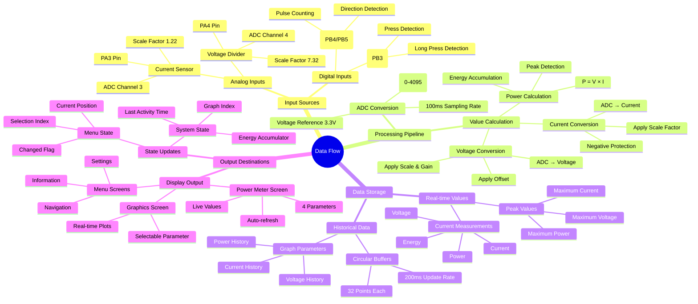
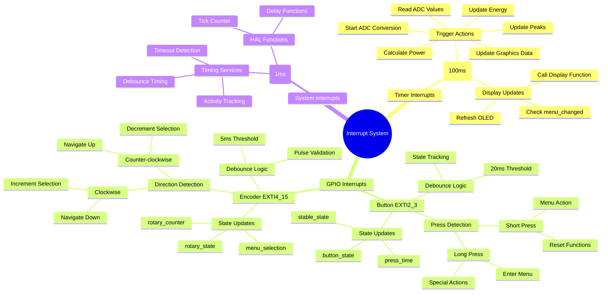
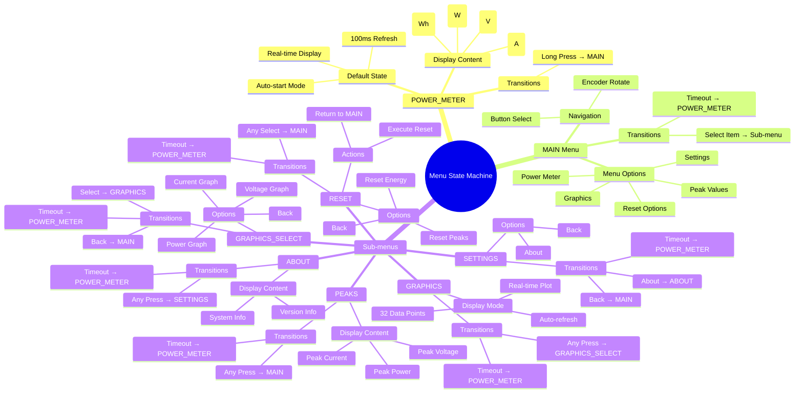
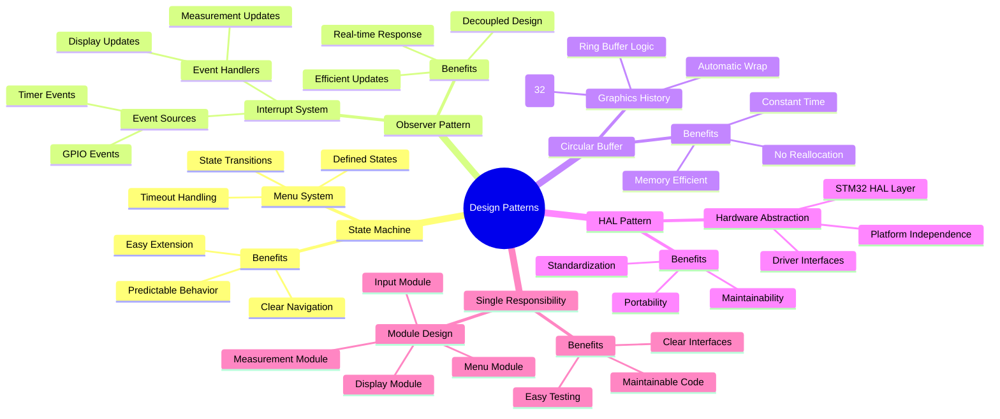

# STM32 Power Meter - Mermaid Mind Map Documentation

## System Architecture Mind Map

```mermaid
mindmap
  root((STM32 Power Meter))
    Main Application
      main()
      SystemClock_Config()
      Error_Handler()
      State Variables
        ADC_HandleTypeDef hadc
        I2C_HandleTypeDef hi2c1
        TIM_HandleTypeDef htim6
    
    Hardware Layer
      STM32L052K6T6
        32KB Flash
        8KB RAM
        32MHz Clock
      Peripherals
        ADC
          Channel 3 (PA3 - Current)
          Channel 4 (PA4 - Voltage)
          12-bit Resolution
        I2C1
          PB6 = SCL
          PB7 = SDA
          SSD1306 OLED
        GPIO
          PB3 - Button
          PB4/PB5 - Encoder
          LED Output
        TIM6
          100ms Period
          Measurement Trigger
        UART1
          PA9/PA10
          Serial Communication
    
    Measurement System
      Constants
        VOLTAGE_SCALE_FACTOR: 7.32f
        VOLTAGE_GAIN: 1.36f
        VOLTAGE_OFFSET: -0.962f
        CURRENT_SCALE_FACTOR: 1.22f
        ADC_VREF: 3.3f
        ADC_RESOLUTION: 4095.0f
      Current Values
        measured_voltage
        measured_current
        calculated_power
        accumulated_energy
        last_timestamp
      Peak Tracking
        peak_voltage
        peak_current
        peak_power
      Functions
        Get_ADC_Value()
        Convert_ADC_to_Voltage()
        Convert_ADC_to_Current()
        Calculate_Power()
        Update_Energy()
        Update_Peaks()
        Reset_Peaks()
        Reset_Energy()
    
    Input System
      Button Handler
        State Variables
          button_state
          button_stable_state
          button_press_time
          button_long_press_handled
          button_last_interrupt_time
        Debouncing
          20ms Delay
        Actions
          Short Press
          Long Press
      Encoder Handler
        State Variables
          rotary_state
          rotary_counter
          rotary_last_interrupt_time
        Debouncing
          5ms Delay
        Actions
          Clockwise Rotation
          Counter-clockwise Rotation
    
    Menu System
      Menu States
        MENU_POWER_METER (0)
          Real-time Display
          Auto-refresh 100ms
        MENU_MAIN
          Navigation Menu
        MENU_PEAKS
          Peak Values Display
        MENU_GRAPHICS
          Real-time Graphs
        MENU_GRAPHICS_SELECT
          Parameter Selection
        MENU_SETTINGS
          Configuration Options
        MENU_RESET
          Reset Functions
        MENU_ABOUT
          System Information
      Navigation
        Handle_Menu_Navigation()
        Handle_Menu_Action()
        30s Auto-timeout
        menu_changed Flag
    
    Display System
      SSD1306 Driver
        128x64 OLED
        I2C Interface
        Functions
          ssd1306_Init()
          ssd1306_Fill()
          ssd1306_SetCursor()
          ssd1306_WriteString()
          ssd1306_UpdateScreen()
          ssd1306_DrawPixel()
          ssd1306_Line()
      Display Functions
        Display_Current_Menu()
        Display_Power_Meter()
        Display_Graphics()
      Graphics System
        Data Storage
          32 Data Points
          voltage_history[]
          current_history[]
          power_history[]
        Update Rate
          200ms Interval
        Parameters
          Voltage Graph
          Current Graph
          Power Graph
    
    Interrupt System
      Timer Interrupt
        TIM6_DAC_IRQHandler()
          Trigger ADC
          Update Measurements
          Update Display
      GPIO Interrupts
        EXTI2_3_IRQHandler()
          Button Events
        EXTI4_15_IRQHandler()
          Encoder Events
      System Tick
        SysTick_Handler()
          HAL Tick Update
```

## Data Flow Mind Map



## Interrupt Flow Mind Map



## Menu State Machine Mind Map



## Design Patterns Mind Map



## Critical Specifications Mind Map

```mermaid
mindmap
  root((Specifications))
    Timing Requirements
      Main Loop
        100ms Measurement
        100ms Display Update
      Debouncing
        Button: 20ms
        Encoder: 5ms
      Timeouts
        Menu: 30 seconds
        Auto-return Feature
      Graphics
        200ms Update Rate
        History Buffer
    
    Memory Constraints
      Flash Memory
        32KB Total
        Code Optimization
        Constant Storage
      RAM Usage
        8KB Total
        Static Allocation
        Buffer Management
      Data Storage
        32-point Buffers
        Reduced from 64
        Memory Efficient
    
    Measurement Specs
      ADC Resolution
        12-bit (0-4095)
        3.3V Reference
      Calibration
        Voltage Scaling
        Current Scaling
        Offset Correction
      Accuracy
        Voltage ±0.1V
        Current ±0.01A
        Power Calculation
    
    Safety Features
      Input Protection
        Negative Current Guard
        Value Clamping
      Error Handling
        Error_Handler()
        Safe Defaults
      Debouncing
        Noise Immunity
        False Trigger Prevention
      Watchdog
        SysTick Monitoring
        System Recovery
```

## Notes

This Mermaid mind map representation maintains all the information from the original PlantUML diagrams while presenting it in a hierarchical, easy-to-navigate format. The mind maps cover:

1. **System Architecture**: Complete hardware and software component overview
2. **Data Flow**: How data moves through the system from inputs to outputs  
3. **Interrupt Flow**: Detailed interrupt handling and timing
4. **Menu State Machine**: Complete menu navigation and transitions
5. **Design Patterns**: Architectural patterns used in the implementation
6. **Critical Specifications**: Timing, memory, measurement, and safety requirements

Each mind map branch can be expanded or collapsed for focused viewing, making it easier to understand specific aspects of the system while maintaining the overall context.