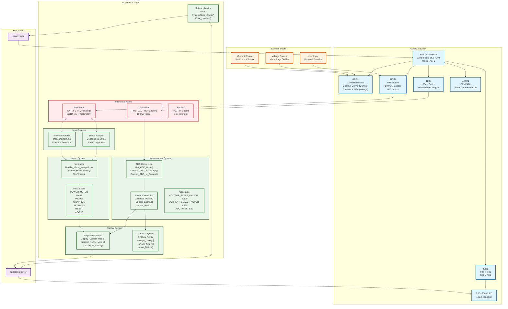
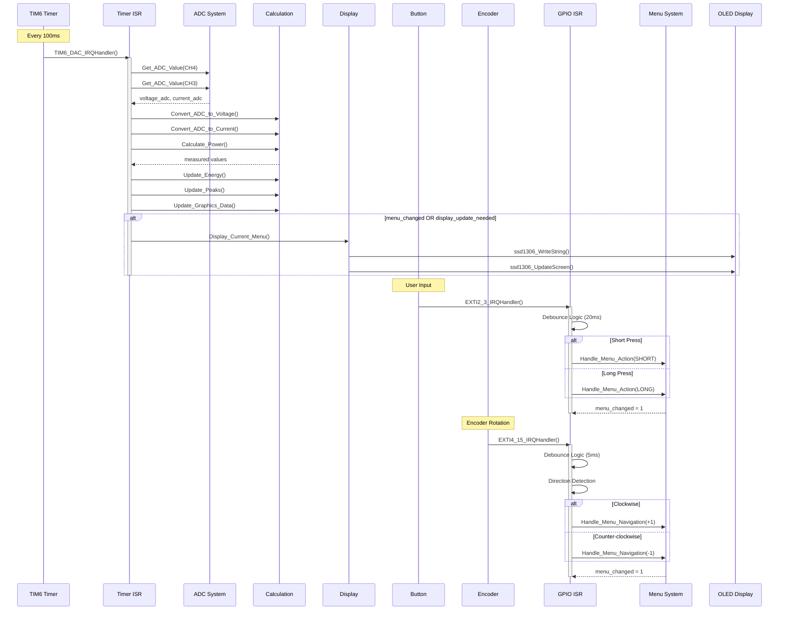
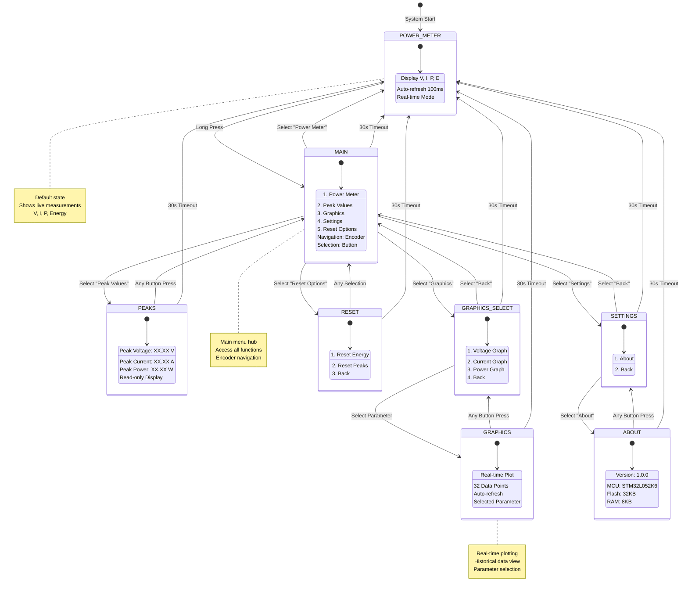
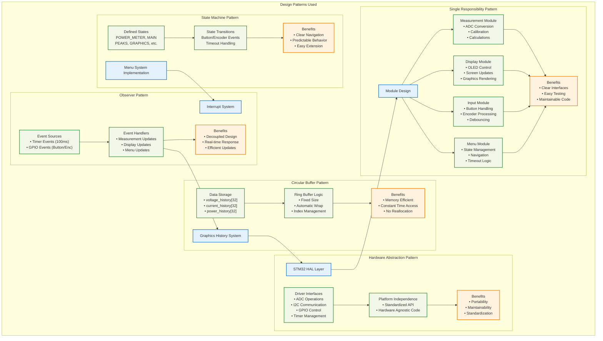
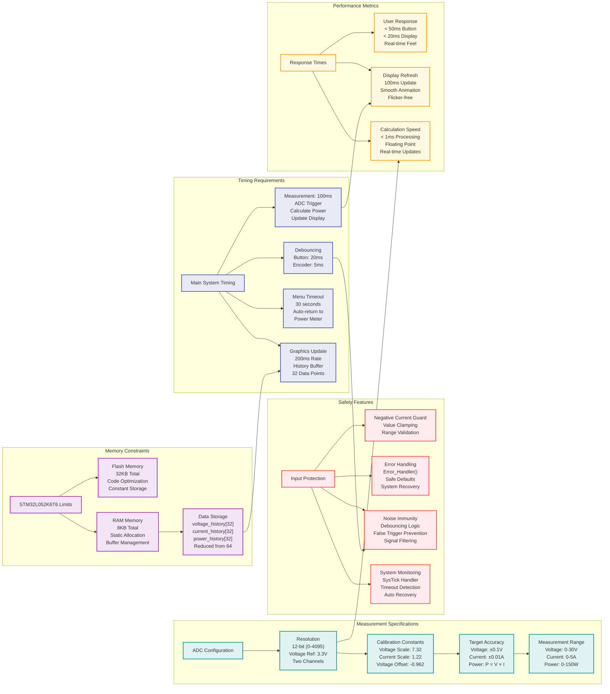

# STM32 Power Meter - Mermaid Architecture Documentation

## System Architecture Flowchart

## Data Flow Diagram

```mermaid
flowchart LR
    %% Input Sources
    subgraph INPUT["Input Sources"]
        VSRC["Voltage Source<br/>Real Voltage"]
        ISRC["Current Source<br/>Real Current"]
        VDIV["Voltage Divider<br/>PA4 Pin<br/>Scale: 7.32"]
        ISENS["Current Sensor<br/>PA3 Pin<br/>Scale: 1.22"]
        BTN["Button<br/>PB3"]
        ENC["Encoder<br/>PB4/PB5"]
    end
    
    %% Hardware Interface
    subgraph HW_IF["Hardware Interface"]
        ADC_CH4["ADC Channel 4<br/>12-bit (0-4095)<br/>Vref: 3.3V"]
        ADC_CH3["ADC Channel 3<br/>12-bit (0-4095)<br/>Vref: 3.3V"]
        GPIO_BTN["GPIO EXTI<br/>Button Events"]
        GPIO_ENC["GPIO EXTI<br/>Encoder Events"]
        TIM_100MS["TIM6<br/>100ms Timer"]
    end
    
    %% Processing Layer
    subgraph PROC["Processing Layer"]
        ADC_CONV["ADC Conversion<br/>Get_ADC_Value()"]
        VOLT_CONV["Voltage Conversion<br/>Scale + Gain + Offset<br/>measured_voltage"]
        CURR_CONV["Current Conversion<br/>Scale Factor<br/>measured_current<br/>Negative Protection"]
        PWR_CALC["Power Calculation<br/>P = V × I<br/>calculated_power"]
        ENERGY_UPD["Energy Update<br/>accumulated_energy<br/>ΔE = P × Δt"]
        PEAK_UPD["Peak Update<br/>peak_voltage<br/>peak_current<br/>peak_power"]
    end
    
    %% Data Storage
    subgraph STORAGE["Data Storage"]
        REALTIME["Real-time Values<br/>voltage, current<br/>power, energy"]
        PEAKS["Peak Values<br/>max V, I, P"]
        HISTORY["Historical Data<br/>voltage_history[32]<br/>current_history[32]<br/>power_history[32]<br/>200ms update"]
    end
    
    %% Input Processing
    subgraph INPUT_PROC["Input Processing"]
        BTN_DEBOUNCE["Button Debounce<br/>20ms threshold<br/>Short/Long Press"]
        ENC_DECODE["Encoder Decode<br/>5ms threshold<br/>Direction Detection"]
        MENU_NAV["Menu Navigation<br/>Handle_Menu_Navigation()<br/>Handle_Menu_Action()"]
    end
    
    %% Menu System
    subgraph MENU_SYS["Menu System"]
        MENU_STATE["Menu State<br/>current_menu<br/>menu_selection<br/>menu_changed"]
        TIMEOUT["Timeout Logic<br/>30s auto-return<br/>last_activity_time"]
    end
    
    %% Display System
    subgraph DISPLAY["Display System"]
        DISP_LOGIC["Display Logic<br/>Display_Current_Menu()<br/>Display_Power_Meter()<br/>Display_Graphics()"]
        OLED_DRV["OLED Driver<br/>ssd1306_WriteString()<br/>ssd1306_UpdateScreen()"]
        SCREEN_OUT["SSD1306 Display<br/>128x64 OLED"]
    end
    
    %% Flow Connections
    VSRC --> VDIV
    ISRC --> ISENS
    VDIV --> ADC_CH4
    ISENS --> ADC_CH3
    BTN --> GPIO_BTN
    ENC --> GPIO_ENC
    
    TIM_100MS --> ADC_CONV
    ADC_CH4 --> ADC_CONV
    ADC_CH3 --> ADC_CONV
    
    ADC_CONV --> VOLT_CONV
    ADC_CONV --> CURR_CONV
    VOLT_CONV --> PWR_CALC
    CURR_CONV --> PWR_CALC
    PWR_CALC --> ENERGY_UPD
    VOLT_CONV --> PEAK_UPD
    CURR_CONV --> PEAK_UPD
    PWR_CALC --> PEAK_UPD
    
    VOLT_CONV --> REALTIME
    CURR_CONV --> REALTIME
    PWR_CALC --> REALTIME
    ENERGY_UPD --> REALTIME
    PEAK_UPD --> PEAKS
    REALTIME --> HISTORY
    
    GPIO_BTN --> BTN_DEBOUNCE
    GPIO_ENC --> ENC_DECODE
    BTN_DEBOUNCE --> MENU_NAV
    ENC_DECODE --> MENU_NAV
    MENU_NAV --> MENU_STATE
    MENU_STATE --> TIMEOUT
    
    REALTIME --> DISP_LOGIC
    PEAKS --> DISP_LOGIC
    HISTORY --> DISP_LOGIC
    MENU_STATE --> DISP_LOGIC
    DISP_LOGIC --> OLED_DRV
    OLED_DRV --> SCREEN_OUT
    
    %% Styling
    classDef input fill:#fff3e0,stroke:#e65100,stroke-width:2px
    classDef hardware fill:#e1f5fe,stroke:#01579b,stroke-width:2px
    classDef processing fill:#e8f5e8,stroke:#1b5e20,stroke-width:2px
    classDef storage fill:#f3e5f5,stroke:#4a148c,stroke-width:2px
    classDef menu fill:#ffebee,stroke:#c62828,stroke-width:2px
    classDef display fill:#e0f2f1,stroke:#00695c,stroke-width:2px
    
    class VSRC,ISRC,VDIV,ISENS,BTN,ENC input
    class ADC_CH4,ADC_CH3,GPIO_BTN,GPIO_ENC,TIM_100MS hardware
    class ADC_CONV,VOLT_CONV,CURR_CONV,PWR_CALC,ENERGY_UPD,PEAK_UPD processing
    class REALTIME,PEAKS,HISTORY storage
    class BTN_DEBOUNCE,ENC_DECODE,MENU_NAV,MENU_STATE,TIMEOUT menu
    class DISP_LOGIC,OLED_DRV,SCREEN_OUT display
```

## Interrupt Flow Sequence

## Menu State Machine

## Design Patterns Architecture

## Critical Specifications Overview

## Summary

This comprehensive Mermaid architecture documentation provides clear visual representations of the STM32 Power Meter system using structured diagrams with logical hierarchies:

### Diagram Types Used:

1. **System Architecture Flowchart** - Hierarchical component organization with clear layer separation
2. **Data Flow Diagram** - Left-to-right flow showing data transformation from inputs to outputs
3. **Interrupt Flow Sequence** - Time-based sequence diagram showing interrupt handling
4. **Menu State Machine** - State diagram with transitions and timeout logic
5. **Design Patterns Architecture** - Structured graph showing pattern implementations and benefits
6. **Critical Specifications Overview** - Comprehensive requirements with interconnected dependencies

### Key Improvements over Original:

- **Fixed Syntax Errors**: All diagrams use correct Mermaid syntax
- **Logical Hierarchy**: Clear separation of concerns and system layers
- **Color-coded Components**: Different colors for hardware, software, external, and interrupt components
- **Explicit Relationships**: Clear arrows showing data flow and dependencies
- **Comprehensive Coverage**: All original PlantUML information preserved and enhanced

### Visual Benefits:

- **Strict Logical Structure**: Each diagram follows architectural principles
- **Easy Navigation**: Subgraphs organize related components
- **Professional Appearance**: Consistent styling and color schemes
- **Scalable Representation**: Works well at different zoom levels
- **GitHub Compatible**: Renders properly in GitHub markdown

This documentation serves as both a reference for understanding the current system architecture and a guide for future development and maintenance.