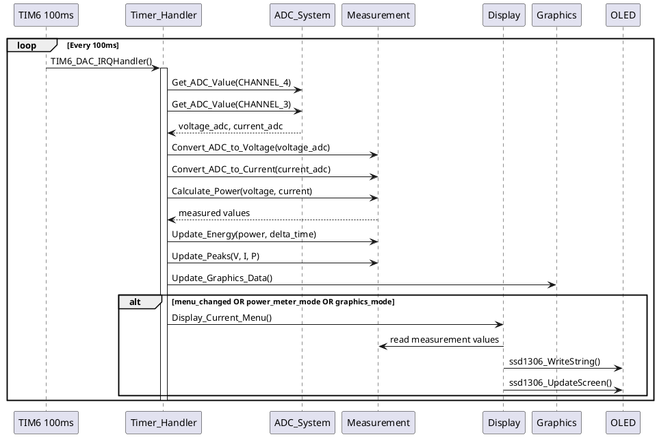
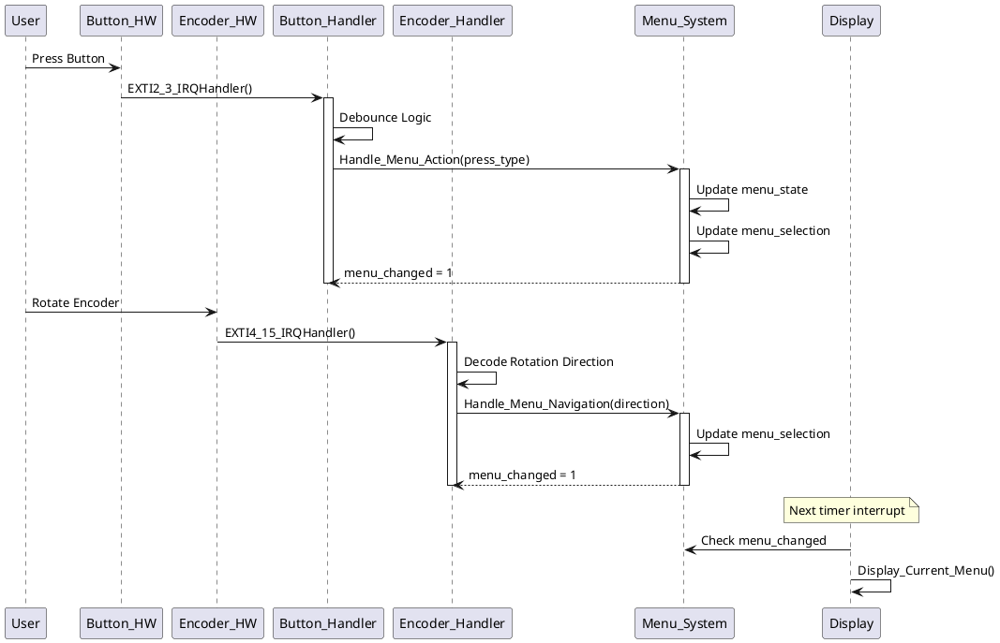
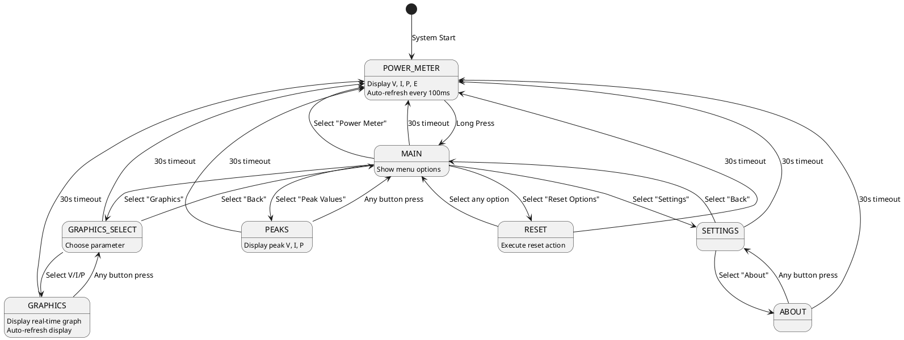
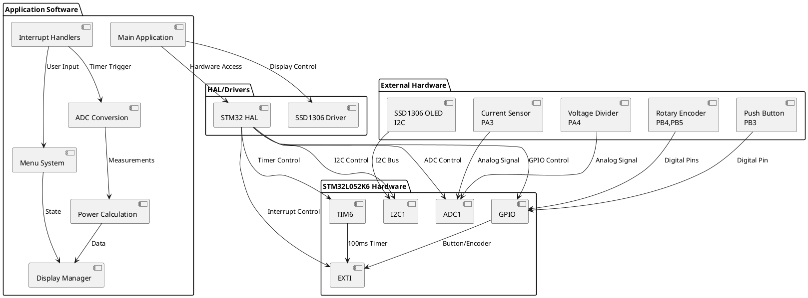

# STM32 Power Meter - main.c UML Structure Diagram

## Class Diagram

```plantuml
@startuml STM32_PowerMeter_Architecture

!define RECTANGLE class

' ====================== MAIN APPLICATION CLASS ======================
RECTANGLE Main {
  +int main(void)
  +void SystemClock_Config(void)
  +void Error_Handler(void)
  --
  -ADC_HandleTypeDef hadc
  -I2C_HandleTypeDef hi2c1  
  -TIM_HandleTypeDef htim6
}

' ====================== HARDWARE INITIALIZATION ======================
RECTANGLE HardwareInit {
  +void MX_GPIO_Init(void)
  +void MX_ADC_Init(void)
  +void MX_I2C1_Init(void)
  +void MX_TIM6_Init(void)
}

' ====================== MEASUREMENT SYSTEM ======================
RECTANGLE MeasurementSystem {
  ' Constants
  +VOLTAGE_SCALE_FACTOR: 7.32f
  +VOLTAGE_GAIN: 1.36f
  +VOLTAGE_OFFSET: -0.962f
  +CURRENT_SCALE_FACTOR: 1.22f
  +ADC_VREF: 3.3f
  +ADC_RESOLUTION: 4095.0f
  --
  ' Current Values
  -measured_voltage: float
  -measured_current: float
  -calculated_power: float
  -accumulated_energy: float
  -last_timestamp: uint32_t
  --
  ' Peak Values
  -peak_voltage: float
  -peak_current: float
  -peak_power: float
  --
  ' Methods
  +uint32_t Get_ADC_Value(uint32_t channel)
  +float Convert_ADC_to_Voltage(uint32_t adc_value)
  +float Convert_ADC_to_Current(uint32_t adc_value)
  +float Calculate_Power(float voltage, float current)
  +void Update_Energy(float power, uint32_t delta_time)
  +void Update_Peaks(float voltage, float current, float power)
  +void Reset_Peaks(void)
  +void Reset_Energy(void)
}

' ====================== INPUT HANDLING ======================
RECTANGLE InputHandler {
  ' Button State
  -button_state: uint8_t
  -button_stable_state: uint8_t
  -button_press_time: uint32_t
  -button_long_press_handled: uint8_t
  -button_last_interrupt_time: uint32_t
  --
  ' Rotary Encoder State
  -rotary_state: uint8_t
  -rotary_counter: uint8_t
  -rotary_last_interrupt_time: uint32_t
  --
  ' Methods
  +void User_Button_Interrupt_Handler(void)
  +void Rotary_Encoder_Interrupt_Handler(void)
}

' ====================== MENU SYSTEM ======================
RECTANGLE MenuSystem {
  ' Menu State Enum
  +enum MenuState_t {
    MENU_POWER_METER = 0
    MENU_MAIN
    MENU_PEAKS
    MENU_GRAPHICS
    MENU_GRAPHICS_SELECT
    MENU_SETTINGS
    MENU_RESET
    MENU_ABOUT
  }
  --
  ' Menu Variables
  -current_menu: MenuState_t
  -menu_selection: uint8_t
  -menu_changed: uint8_t
  -last_activity_time: uint32_t
  +MENU_TIMEOUT_MS: 30000
  --
  ' Methods
  +void Handle_Menu_Navigation(int8_t direction)
  +void Handle_Menu_Action(uint8_t press_type)
}

' ====================== DISPLAY SYSTEM ======================
RECTANGLE DisplaySystem {
  ' Methods
  +void Display_Current_Menu(void)
  +void Display_Power_Meter(void)
  +void Display_Graphics(void)
}

' ====================== GRAPHICS SYSTEM ======================
RECTANGLE GraphicsSystem {
  ' Graphics Data
  +GRAPH_DATA_POINTS: 32
  -voltage_history[32]: float
  -current_history[32]: float
  -power_history[32]: float
  -graph_data_index: uint8_t
  -graphics_parameter: uint8_t
  -last_graph_update: uint32_t
  --
  ' Methods
  +void Update_Graphics_Data(void)
}

' ====================== INTERRUPT HANDLERS ======================
RECTANGLE InterruptHandlers {
  +void Timer_Interrupt_Handler(void)
  +void TIM6_DAC_IRQHandler(void)
  +void EXTI2_3_IRQHandler(void)
  +void EXTI4_15_IRQHandler(void)
  +void SysTick_Handler(void)
}

' ====================== EXTERNAL LIBRARIES ======================
RECTANGLE SSD1306_Driver {
  +void ssd1306_Init(void)
  +void ssd1306_Fill(SSD1306_COLOR color)
  +void ssd1306_SetCursor(uint8_t x, uint8_t y)
  +void ssd1306_WriteString(char* str, FontDef Font, SSD1306_COLOR color)
  +void ssd1306_UpdateScreen(void)
  +void ssd1306_DrawPixel(uint8_t x, uint8_t y, SSD1306_COLOR color)
  +void ssd1306_Line(uint8_t x1, uint8_t y1, uint8_t x2, uint8_t y2, SSD1306_COLOR color)
}

RECTANGLE STM32_HAL {
  +HAL_Init()
  +HAL_GetTick(): uint32_t
  +HAL_Delay(uint32_t Delay)
  +HAL_ADC_*()
  +HAL_I2C_*()
  +HAL_TIM_*()
  +HAL_GPIO_*()
}

' ====================== RELATIONSHIPS ======================

' Main Dependencies
Main ||--|| HardwareInit : initializes
Main ||--|| InterruptHandlers : uses
Main ||--|| STM32_HAL : depends on

' Hardware Init Dependencies
HardwareInit ||--|| STM32_HAL : uses

' Measurement System
InterruptHandlers ||--|| MeasurementSystem : calls every 100ms
MeasurementSystem ||--|| STM32_HAL : ADC operations

' Input Handling
InterruptHandlers ||--|| InputHandler : button/encoder events
InputHandler ||--|| MenuSystem : navigation/actions
InputHandler ||--|| STM32_HAL : GPIO operations

' Menu System
MenuSystem ||--|| DisplaySystem : triggers display updates
MenuSystem ||--|| MeasurementSystem : reset operations

' Display System
DisplaySystem ||--|| SSD1306_Driver : OLED operations
DisplaySystem ||--|| MeasurementSystem : reads values
DisplaySystem ||--|| GraphicsSystem : graphics display
DisplaySystem ||--|| MenuSystem : menu state

' Graphics System
InterruptHandlers ||--|| GraphicsSystem : data updates
GraphicsSystem ||--|| MeasurementSystem : historical data

@enduml
```

## Sequence Diagram - Main Operation Flow



## Sequence Diagram - User Input Flow



## State Machine Diagram - Menu System



## Component Diagram - System Architecture



## Data Flow Diagram

```plantuml
@startuml DataFlow_Diagram

' External Inputs
[Real Voltage] --> [Voltage Divider PA4]
[Real Current] --> [Current Sensor PA3]
[User Input] --> [Button PB3]
[User Input] --> [Encoder PB4,PB5]

' Hardware Layer
[Voltage Divider PA4] --> [ADC Channel 4]
[Current Sensor PA3] --> [ADC Channel 3]
[Button PB3] --> [GPIO EXTI]
[Encoder PB4,PB5] --> [GPIO EXTI]
[Timer TIM6] --> [100ms Interrupt]

' Conversion Layer
[ADC Channel 4] --> [Convert_ADC_to_Voltage()]
[ADC Channel 3] --> [Convert_ADC_to_Current()]
[Convert_ADC_to_Voltage()] --> [measured_voltage]
[Convert_ADC_to_Current()] --> [measured_current]

' Calculation Layer
[measured_voltage] --> [Calculate_Power()]
[measured_current] --> [Calculate_Power()]
[Calculate_Power()] --> [calculated_power]
[calculated_power] --> [Update_Energy()]
[Update_Energy()] --> [accumulated_energy]

' Peak Tracking
[measured_voltage] --> [Update_Peaks()]
[measured_current] --> [Update_Peaks()]
[calculated_power] --> [Update_Peaks()]
[Update_Peaks()] --> [peak_voltage]
[Update_Peaks()] --> [peak_current]
[Update_Peaks()] --> [peak_power]

' Graphics Data
[measured_voltage] --> [voltage_history[]]
[measured_current] --> [current_history[]]
[calculated_power] --> [power_history[]]

' Menu System
[GPIO EXTI] --> [Handle_Menu_Navigation()]
[GPIO EXTI] --> [Handle_Menu_Action()]
[Handle_Menu_Navigation()] --> [menu_selection]
[Handle_Menu_Action()] --> [current_menu]

' Display Output
[measured_voltage] --> [Display_Power_Meter()]
[measured_current] --> [Display_Power_Meter()]
[calculated_power] --> [Display_Power_Meter()]
[accumulated_energy] --> [Display_Power_Meter()]
[peak_voltage] --> [Display_Peaks()]
[peak_current] --> [Display_Peaks()]
[peak_power] --> [Display_Peaks()]
[voltage_history[]] --> [Display_Graphics()]
[current_history[]] --> [Display_Graphics()]
[power_history[]] --> [Display_Graphics()]
[current_menu] --> [Display_Current_Menu()]
[menu_selection] --> [Display_Current_Menu()]

' Final Output
[Display_Current_Menu()] --> [SSD1306 OLED Display]

@enduml
```

## Notes

### Key Design Patterns Used:
1. **State Machine Pattern**: Menu system navigation
2. **Observer Pattern**: Interrupt-driven updates
3. **Circular Buffer Pattern**: Graphics history data
4. **Hardware Abstraction Layer**: STM32 HAL usage
5. **Single Responsibility**: Each module handles specific functionality

### Critical Timing:
- **100ms Timer**: Main measurement and display refresh cycle
- **Debouncing**: 20ms for button, 5ms for encoder
- **Menu Timeout**: 30 seconds auto-return to power meter
- **Graphics Update**: 200ms interval for history buffer

### Memory Usage:
- **Flash**: Optimized for 32KB constraint
- **RAM**: 32 data points for graphics (reduced from 64)
- **Static Variables**: All global state in static scope

### Safety Features:
- **Negative Value Protection**: Current cannot go below 0A
- **Debouncing**: All inputs properly debounced
- **Error Handling**: Error_Handler() for critical failures
- **Watchdog**: System handles via SysTick