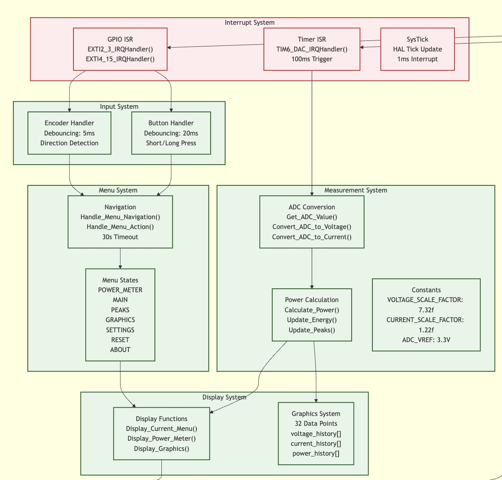

# STM32 Power Meter - System Overview

## System Architecture

Looking at the system architecture diagram below, the power meter is built around three main interrupt sources that drive the entire system:

*The diagram above shows how the interrupt system drives the entire power meter operation. The 100ms timer triggers measurements, GPIO interrupts handle user input, and everything flows through the menu system to the display.*

The whole thing works pretty simply - there's a 100ms timer that kicks off measurements, GPIO interrupts that handle user input, and a 1ms SysTick for general housekeeping.

## How the Code Works

When you power on the device, it sits in the main power meter display showing voltage, current, power and energy. Every 100ms, TIM6 fires an interrupt that:

- Grabs ADC readings from PA3 (current sensor) and PA4 (voltage divider)
- Runs the conversion math using those scale factors (7.32 for voltage, 1.22 for current)
- Calculates power and updates the energy counter
- Keeps track of peak values
- Updates the display if something changed

The user interface is handled by separate GPIO interrupts. The button on PB3 gets debounced over 20ms and can detect short presses vs long presses. The rotary encoder on PB4/PB5 gets debounced over 5ms and figures out which direction you're turning.

All the menu logic is pretty straightforward - there are 7 different states (POWER_METER, MAIN, PEAKS, etc.) and the encoder/button combo lets you navigate between them. If you don't touch anything for 30 seconds, it automatically goes back to the main power display.

The graphics system keeps 32 data points of history for voltage, current and power so you can see trends over time. The display functions just read from these buffers and draw whatever menu or graph you're looking at.

## Constants and Calibration

The measurement accuracy depends on these calibration values:
- Voltage scale factor: 7.32 (converts ADC reading to actual voltage)
- Current scale factor: 1.22 (converts ADC reading to actual current) 
- ADC reference: 3.3V with 12-bit resolution (0-4095 counts)

## Testing the User Interface

When you want to test the device, here's what you do:

**Start with the power display** - When you first turn it on, you'll see the voltage, current, power and energy readings updating every 100ms.

**Get into the menu** - Hold down the button for more than 2.5 seconds. The screen will switch to show the main menu.

**Navigate around** - Turn the encoder knob clockwise or counter-clockwise to move between menu options. You'll see the selection highlight move up and down.

**Select stuff** - When you find what you want, press the button briefly to select it. This takes you into that submenu.

**Try each menu:**
- Peak Values: Shows the highest voltage, current and power you've measured
- Graphics: Lets you pick voltage, current or power to see a real-time graph
- Settings: Just shows some basic info about the device
- Reset Options: Clears different types of data

**Getting back** - From any submenu, press the button to go back to the main menu. Or just wait 30 seconds and it'll automatically return to the power display.

The whole interface is pretty simple - just the encoder to navigate and the button to select. If you get lost, wait 30 seconds and you'll be back at the main power display.
---
*Written for the STM32L052K6T6 Power Meter project*